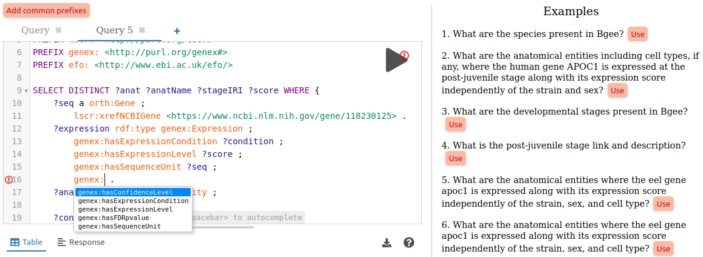

<div align="center">

# 💫 SPARQL editor web component

[](https://www.npmjs.com/package/@sib-swiss/sparql-editor)
[](https://github.com/sib-swiss/sparql-editor/actions/workflows/deploy.yml)

</div>

A standard web component to easily deploy a user-friendly SPARQL query editor for a specific SPARQL endpoint, based on the popular [YASGUI editor](https://github.com/zazuko/Yasgui) with advanced autocomplete for predicates based on classes.

The editor retrieves metadata about the endpoint by directly querying the SPARQL endpoint, so all you need to do is to properly document your endpoint. Reducing the need for complex infrastructure, while making your SPARQL endpoints easier to query for users and machines.

- **Prefixes** are automatically pulled from the endpoint using their definition defined with the [SHACL ontology](https://www.w3.org/TR/shacl/) (`sh:prefix`/`sh:namespace`).
- **Example SPARQL queries** defined using the SHACL ontology are automatically pulled from the endpoint (queries are defined with `sh:select|sh:ask|sh:construct|sh:describe`, and their human readable description with `rdfs:comment`). Checkout the [`sparql-examples`](https://github.com/sib-swiss/sparql-examples) project for more details.
- **Autocomplete possibilities for properties and classes** are automatically pulled from the endpoint based on [VoID description](https://www.w3.org/TR/void/) present in the triplestore (`void:linkPredicate|void:property` and `void:class`). The proposed properties are filtered based on the predicates available for the class of the subject related to where your cursor is 🤯. Checkout the [`void-generator`](https://github.com/JervenBolleman/void-generator) project to automatically generate VoID description for your endpoint.

👆️ You can **try it** for a few SPARQL endpoints of the SIB, such as UniProt and Bgee, here: **[sib-swiss.github.io/sparql-editor](https://sib-swiss.github.io/sparql-editor)**


---



## 🚀 Use

1. Import from CDN

   ```html
   <script type="module" src="https://unpkg.com/@sib-swiss/sparql-editor"></script>
   ```

   Or install with a package manager in your project:

   ```bash
   npm install --save @sib-swiss/sparql-editor
   # or
   pnpm add @sib-swiss/sparql-editor
   ```

2. Use the custom element in your HTML/JSX/TSX code:

   ```html
   <sparql-editor endpoint="https://sparql.uniprot.org/sparql/"></sparql-editor>
   ```

   You can customize the number of examples displayed on the main page, buttons color, and provide other HTML elements to be included under the SPARQL examples (e.g. about and links to relevant resources):

   ```html
   <sparql-editor
     endpoint="https://www.bgee.org/sparql/"
     examples-on-main-page="10"
     style="--btn-color: white; --btn-bg-color: #00709b;"
   >
     <h1>About</h1>
     <p>This SPARQL endpoint contains things</p>
   </sparql-editor>
   ```

> [!WARNING]
>
> Metadata are retrieved by a few lightweight queries sent from client-side JavaScript when the editor is initialized, so your SPARQL **endpoint should accept CORS** (either from \*, which is recommended, or just from the URL where the editor is deployed)

## 📝 Basic example

No need for a complex project you can integrate SPARQL editor in any HTML page by importing from a CDN.

Create a `index.html` file with:

```html
<!doctype html>
<html lang="en">
  <head>
    <meta charset="utf-8" />
    <meta name="viewport" content="width=device-width, initial-scale=1" />
    <title>SPARQL editor dev</title>
    <meta name="description" content="SPARQL editor demo page" />
    <link rel="icon" type="image/png" href="https://upload.wikimedia.org/wikipedia/commons/f/f3/Rdf_logo.svg" />
    <!-- Import the module from a CDN -->
    <script type="module" src="https://unpkg.com/@sib-swiss/sparql-editor@0.1.4"></script>
  </head>

  <body>
    <div>
      <sparql-editor
        endpoint="https://www.bgee.org/sparql/"
        examples-on-main-page="10"
        style="--btn-color: white; --btn-bg-color: #00709b;"
      >
        <h1>About</h1>
        <p>This SPARQL endpoint contains...</p>
      </sparql-editor>
    </div>
  </body>
</html>
```

Then just open this HTML page in your favorite browser.

You can also start a basic web server with NodeJS or Python (recommended):

```bash
npx http-server
# or
python -m http.server
```

## 🛠️ Development

> Requirement: [NodeJS](https://nodejs.org/en) installed.

Clone the repository obviously, and get into the repository root folder.

Install:

```bash
npm install
```

Run in development:

```bash
npm run dev
```

Auto format code with prettier:

```bash
npm run fmt
```

Lint with eslint (we recommend to install the [`ESLint`](https://marketplace.visualstudio.com/items?itemName=dbaeumer.vscode-eslint) extension on VSCode):

```bash
npm run lint
```

Build for production in the `dist` folder:

```bash
npm run build
```

Run the [demo pages](https://sib-swiss.github.io/sparql-editor) locally:

```bash
npm run demo
```

Update dependencies to the latest available versions:

```bash
npx npm-check-updates -u
```

## 🏷️ Release

To create a new release:

- Login with `npm adduser` if not already done

- Upgrade version in `package.json`

- Run release script:

  ```bash
  npm run release
  ```

- Create release on GitHub

## 🤝 Credits

Thanks to:

- [Triply](https://triply.cc) for originally developing the YASGUI editor
- [Zazuko](https://zazuko.com/) for keeping it up-to-date the last few years
